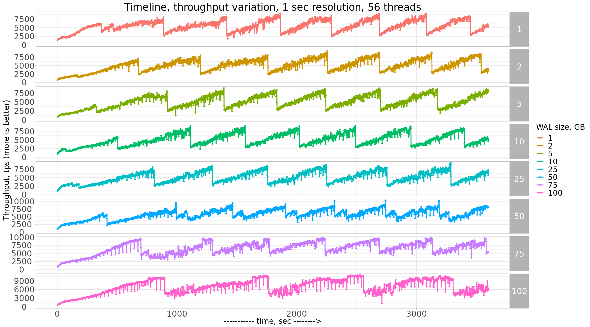
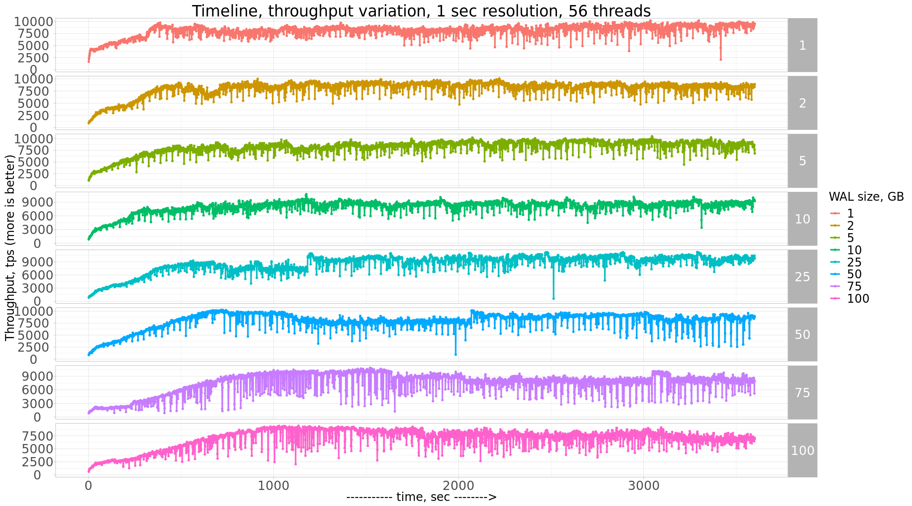
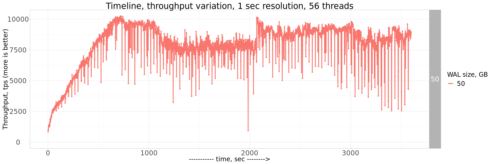

# PostgreSQL Checkpointing

Hardware specifications:

```
System | Supermicro; SYS-F619P2-RTN; v0123456789 (Other)
   Platform | Linux
    Release | Ubuntu 18.04.4 LTS (bionic)
     Kernel | 5.3.0-42-generic
Architecture | CPU = 64-bit, OS = 64-bit
  Threading | NPTL 2.27
    SELinux | No SELinux detected
Virtualized | No virtualization detected
# Processor ##################################################
 Processors | physical = 2, cores = 40, virtual = 80, hyperthreading = yes
     Models | 80xIntel(R) Xeon(R) Gold 6230 CPU @ 2.10GHz
     Caches | 80x28160 KB
# Memory #####################################################
      Total | 187.6G
```

For the benchmark I use sysbench-tpcc 1000W, prepared database as

```
./tpcc.lua --pgsql-user=sbtest --pgsql-password=sbtest --pgsql-db=sbtest --time=120 --threads=56 --report-interval=1 --tables=10 --scale=100 --use_fk=0 --trx_level=RC --db-driver=pgsql prepare
```

PosgtreSQL Config:

```
shared_buffers = '140GB'
work_mem = '4MB'
random_page_cost = '1'
maintenance_work_mem = '2GB'

wal_level = 'replica'
max_wal_senders = '3'

synchronous_commit = 'on'
seq_page_cost = '1'
synchronous_commit = 'on'

checkpoint_completion_target = '0.9'
checkpoint_timeout = '900'

max_wal_size = '50GB'
min_wal_size = '1GB'

autovacuum_vacuum_scale_factor = '0.4'
effective_cache_size = '200GB'
bgwriter_lru_maxpages = '1000'
bgwriter_lru_multiplier = '10.0'
logging_collector = 'ON'
wal_compression = 'ON'
log_checkpoints = 'ON'
archive_mode = 'OFF'
full_page_writes = 'ON'
fsync = 'ON'
```


```R
library(IRdisplay)

display_html(
'<script>  
code_show=false; 
function code_toggle() {
  if (code_show){
    $(\'div.input\').hide();
  } else {
    $(\'div.input\').show();
  }
  code_show = !code_show
}  
$( document ).ready(code_toggle);
</script>
  <form action="javascript:code_toggle()">
    <input type="submit" value="Click here to toggle on/off the raw code.">
 </form>'
)
```


<script>  
code_show=true; 
function code_toggle() {
  if (code_show){
    $('div.input').hide();
  } else {
    $('div.input').show();
  }
  code_show = !code_show
}  
$( document ).ready(code_toggle);
</script>
  <form action="javascript:code_toggle()">
    <input type="submit" value="Click here to toggle on/off the raw code.">
 </form>


```R
library (RCurl)
library(ggplot2)
library(repr)
```


```R
loadd  <- function () {
    WAL <- c(1,2,5,10,25,50,75,100)
    res = data.frame()
    for (val in WAL) {
        #https://raw.githubusercontent.com/Percona-Lab-results/PostgreSQL-Checkpoint-Jul2020/master/res/res.wal100G.chk900s.ssd.txt
        urldown=paste0("https://raw.githubusercontent.com/Percona-Lab-results/PostgreSQL-Checkpoint-Jul2020/master/res/res.wal",val,"G.chk900s.ssd.csv")
        download <- getURL(urldown)
        
        dl<-strsplit(download, split='\n')
        data <- read.csv (text = grep("^[0-9]", dl[[1]], value = TRUE), header=F)
        
        data$WAL=val
        if(nrow(res)<1){
            res<-data
        }else{
            res<-rbind(data,res)
        }
    }
    
    return(res)
}


```


```R
loadd1  <- function () {
    WAL <- c(1,2,5,10,25,50,75,100)
    res = data.frame()
    for (val in WAL) {
        #https://raw.githubusercontent.com/Percona-Lab-results/PostgreSQL-Checkpoint-Jul2020/master/res/res1/res.wal100G.chk1800s.ssd.txt
        urldown=paste0("https://raw.githubusercontent.com/Percona-Lab-results/PostgreSQL-Checkpoint-Jul2020/master/res/res1/res.wal",val,"G.chk1800s.ssd.txt")
        download <- getURL(urldown)
        
        dl<-strsplit(download, split='\n')
        data <- read.csv (text = grep("^[0-9]", dl[[1]], value = TRUE), header=F)
        
        data$WAL=val
        if(nrow(res)<1){
            res<-data
        }else{
            res<-rbind(data,res)
        }
    }
    
    return(res)
}

```


```R
r1 <- loadd()
#r2 <- loadd("GR8","5")
#r3 <- loadd("PXC8","3")
#r4 <- loadd("PXC8","5")
#results<-rbind(r1,r2,r3,r4)
results<-r1
```


```R
r2 <- loadd1()

results2<-r2
```
print(results)

```R
theme_set(theme_light())
theme_replace(axis.text.x=element_text(size = rel(2)))
theme_replace(axis.text.y=element_text(size = rel(2)))
theme_replace(axis.title.x=element_text(size = rel(1.5)))
theme_replace(axis.title.y=element_text(size = rel(1.5), angle = 90))
theme_replace(legend.title=element_text(size = rel(1.5)))
theme_replace(legend.text=element_text(size = rel(1.5)))
theme_replace(plot.title=element_text(size = rel(2)))
theme_replace(strip.text.x=element_text(size = rel(2)))
theme_replace(strip.text.y=element_text(size = rel(2)))


```

## Results
Let’s review the results I’ve got.


### PostgreSQL, timeline for 56 threads and different WAL sizes


```R
m <- ggplot(data = subset(results), 
            aes(x=V1, y=V3,color=as.factor(WAL)))

options(repr.plot.width=18, repr.plot.height=10)


m + geom_line(size=1)+geom_point(size=1)+
    ylab("Throughput, tps (more is better)")+
    xlab("----------- time, sec -------->")+
    labs(title="Timeline, throughput variation, 1 sec resolution, 56 threads")+    
    expand_limits(y=0)+
    scale_colour_discrete(name="WAL size, GB")+
    facet_grid(WAL ~ .,scales="free")
```





# full_page_writes = off

```
shared_buffers = '140GB'
work_mem = '4MB'
random_page_cost = '1'
maintenance_work_mem = '2GB'

wal_level = 'replica'
max_wal_senders = '3'

synchronous_commit = 'on'
seq_page_cost = '1'
synchronous_commit = 'on'

checkpoint_completion_target = '0.93'
checkpoint_timeout = '1800'

max_wal_size = '50GB'
min_wal_size = '1GB'

autovacuum_vacuum_scale_factor = '0.4'
effective_cache_size = '200GB'
bgwriter_lru_maxpages = '1000'
bgwriter_lru_multiplier = '10.0'
logging_collector = 'ON'
wal_compression = 'ON'
log_checkpoints = 'ON'
archive_mode = 'OFF'
#full_page_writes = 'ON'
fsync = 'ON'
full_page_writes = off
```


```R
m <- ggplot(data = subset(results2), 
            aes(x=V1, y=V3,color=as.factor(WAL)))

options(repr.plot.width=18, repr.plot.height=10)


m + geom_line(size=1)+geom_point(size=1)+
    ylab("Throughput, tps (more is better)")+
    xlab("----------- time, sec -------->")+
    labs(title="Timeline, throughput variation, 1 sec resolution, 56 threads")+    
    expand_limits(y=0)+
    scale_colour_discrete(name="WAL size, GB")+
    facet_grid(WAL ~ .,scales="free")
```





```R
m <- ggplot(data = subset(results2, WAL==50), 
            aes(x=V1, y=V3,color=as.factor(WAL)))

options(repr.plot.width=18, repr.plot.height=6)


m + geom_line(size=1)+geom_point(size=1)+
    ylab("Throughput, tps (more is better)")+
    xlab("----------- time, sec -------->")+
    labs(title="Timeline, throughput variation, 1 sec resolution, 56 threads")+    
    expand_limits(y=0)+
    scale_colour_discrete(name="WAL size, GB")+
    facet_grid(WAL ~ .,scales="free")
```





```R

```
